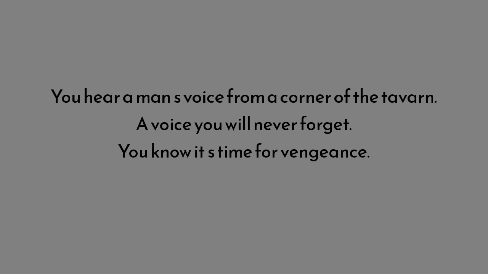

# Vengeance of the blind samuri

Author: Weisheng Li

Design: It's a text-based fighting game. As a blind samuri, you cannot see where your opponent is or even where you are. All you can trust is the voice in your mind. This game tries to present a slow and minimalistic fighting game.

Text Drawing: Most of the glyph bitmap (128 ASCII glyphs) is precomputed and stored as textures when the game initialize, while the shaping is done at run time.

Choices: It's basically a state machine. The player and the enemy state are both stored in and updated by the state machine. Different text are shown based on the current player and enemy state as well as the last action they took.

Screen Shot:

How To Play:
Press A to attack, S to charge your next attack, and D to move. 
attack is great but the enemy is not always within your reach.
charge can strengthen your next attack but you are defenseless while charging.
move can be used to find or run away from the enemy.

Sources: N/A

This game was built with [NEST](NEST.md).

